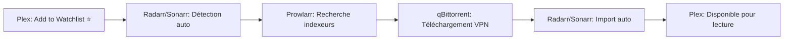
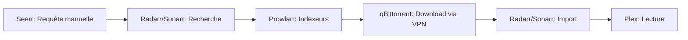

# 🎬 Stack Media Server - Docker Servarr Complète

Installation moderne et portable d'une stack de téléchargement et streaming automatisée avec Docker + VPN.

**✨ Workflow** : Ajoutez un film à votre Watchlist Plex → Téléchargement automatique via VPN → Disponible pour streaming !

---

## 🎯 Services inclus

| Service       | Description                          | Port  | VPN |
|---------------|--------------------------------------|-------|-----|
| **Plex**          | Serveur de streaming (Netflix maison) | 32400 | ❌ |
| **Prowlarr**      | Gestionnaire d'indexeurs centralisé  | 9696  | ❌ |
| **Radarr**        | Gestionnaire de films automatisé    | 7878  | ❌ |
| **Sonarr**        | Gestionnaire de séries automatisé   | 8989  | ❌ |
| **qBittorrent**   | Client torrent **protégé par VPN**   | 8090  | ✅ |
| **Gluetun**       | Conteneur VPN (NordVPN OpenVPN)      | -     | - |
| **Flaresolverr**  | Contournement Cloudflare             | 8191  | ❌ |
| **Seerr**         | Interface de requêtes (optionnel)    | 5055  | ❌ |

## 🚀 Démarrage rapide

```bash
# 1. Nettoyer l'ancienne installation (si existante)
chmod +x cleanup.sh
./cleanup.sh

# 2. Créer la structure de dossiers
mkdir -p /Users/dev/data/downloads/{incomplete,complete}
mkdir -p /Users/dev/data/media/{movies,tv}

# 3. Configurer NordVPN dans .env
nano .env
# Ajoutez vos Service Credentials NordVPN :
# NORDVPN_SERVICE_USER=votre_user
# NORDVPN_SERVICE_PASSWORD=votre_password

# 4. Démarrer la stack
docker-compose up -d

# 5. Vérifier le VPN
docker exec gluetun wget -qO- https://ipinfo.io/ip
# L'IP doit être celle du VPN (différente de votre IP publique)

# 6. Installer YGGTorrent dans Prowlarr
./install-ygg.sh
# Puis dans Prowlarr (http://localhost:9696) :
# - System → Tasks → Lancer "Indexer Definition Update"
# - Indexers → Add Indexer → Chercher "YGGApi"
# - Configurer avec votre Passkey YGG

# 7. Configurer Plex (optionnel - claim token)
# Allez sur https://plex.tv/claim et copiez le token
nano .env  # Ajoutez: PLEX_CLAIM=claim-xxxx
docker-compose restart plex

# 8. Vérifier que tout tourne
docker-compose ps
```

## 🔧 Makefile - Gestion simplifiée

**Toutes les commandes courantes sont disponibles via le Makefile !**

```bash
# Afficher l'aide complète
make help

# Commandes essentielles
make start              # Démarrer tous les services
make stop               # Arrêter tous les services
make restart            # Redémarrer tous les services
make status             # Voir l'état des services

# Logs
make logs               # Voir tous les logs
make logs-radarr        # Logs Radarr uniquement
make logs-sonarr        # Logs Sonarr uniquement
make logs-qbit          # Logs qBittorrent

# Mise à jour
make update             # Mettre à jour tous les services
make update-radarr      # Mettre à jour Radarr uniquement
make update-seerr       # Mettre à jour Seerr uniquement

# Backup & Restore
make backup-all         # Sauvegarder toutes les configs
make backup-radarr      # Sauvegarder Radarr
make list-backups       # Lister les sauvegardes

# VPN
make vpn-check          # Vérifier l'IP VPN
make vpn-rotate         # Changer de serveur VPN
make vpn-restart        # Redémarrer le VPN

# Diagnostic
make check              # Vérification complète du système
make health             # État de santé des services
make media-stats        # Statistiques des médias
make qbit-password      # Afficher le mot de passe qBittorrent

# Nettoyage
make clean              # Nettoyer les images inutilisées
make clean-downloads    # Nettoyer les téléchargements

# URLs
make urls               # Afficher toutes les URLs d'accès
```

**Installation complète en une commande :**
```bash
make install            # Crée la structure + démarre tout
```

## ⚙️ Configuration des services (Ordre recommandé)

### 1. Prowlarr (http://localhost:9696)
- Ajouter Flaresolverr : Host `http://flaresolverr:8191`, Tags `flaresolverr`
- Installer YGG : `./install-ygg.sh` puis System → Tasks → Indexer Definition Update
- Ajouter indexeurs publics (1337x, etc.) : **IMPORTANT** - Ajoutez le tag `flaresolverr` pour éviter les erreurs 429
  - Indexers → Add Indexer → 1337x → Edit → Tags → `flaresolverr` → Save
- Ajouter Radarr/Sonarr : Settings → Apps → Add Application
  - Prowlarr Server : `http://prowlarr:9696`
  - Radarr Server : `http://radarr:7878`
  - Sonarr Server : `http://sonarr:8989`

### 2. qBittorrent (http://localhost:8090)
- Username : `admin`
- Password : `docker logs qbittorrent 2>&1 | grep "temporary password"`
- Tools → Options → Web UI → **Décocher "Enable Host header validation"**
- Downloads → Default Save Path : `/data/downloads/complete`
- Downloads → Keep incomplete in : `/data/downloads/incomplete`

### 3. Radarr (http://localhost:7878)
- Settings → Media Management → Root Folder : `/data/media/movies`
- Settings → Download Clients → Add qBittorrent :
  - Host : `gluetun`
  - Port : `8090`
  - Category : `radarr-movies`
- **🎯 Custom Formats (VF/VOSTFR)** : Pour prioriser les releases MULTi (VF+VO+VOSTFR), configurez les Custom Formats
  - Voir [GUIDE.md](GUIDE.md) section "Custom Formats (Qualité et Langues)" pour la configuration complète

### 4. Sonarr (http://localhost:8989)
- Settings → Media Management → Root Folder : `/data/media/tv`
- Settings → Download Clients → Add qBittorrent :
  - Host : `gluetun`
  - Port : `8090`
  - Category : `sonarr-tv`
- **Custom Formats** : Même configuration que Radarr (voir [GUIDE.md](GUIDE.md))


### 5. Plex (http://localhost:32400/web)
- Connectez-vous avec votre compte Plex
- Ajoutez les bibliothèques :
  - Films : `/data/media/movies`
  - Séries : `/data/media/tv`
- **🎯 Plex Watchlist (RECOMMANDÉ)** : Configurez Radarr/Sonarr pour surveiller votre Plex Watchlist
  - **Radarr** → Settings → Lists → Add List → Plex Watchlist
  - **Sonarr** → Settings → Import Lists → Add List → Plex Watchlist
  - **Enable Automatic Add** : ✅
  - Authentifiez-vous avec Plex.tv
  - **Résultat** : Ajoutez un film/série à votre Watchlist Plex = téléchargement automatique !
  - **Plus besoin de Seerr** si vous utilisez cette méthode

### 6. Seerr (http://localhost:5055) - OPTIONNEL si vous utilisez Plex Watchlist
- Connecter Plex : Hostname `plex`, Port `32400`
- Ajouter Radarr : Hostname `radarr`, Port `7878`
- Ajouter Sonarr : Hostname `sonarr`, Port `8989`

## 📚 Documentation (4 Fichiers)

### 🚀 Guides essentiels

1. **[README.md](README.md)** ← Vous êtes ici (vue d'ensemble + démarrage rapide)
2. **[GUIDE.md](GUIDE.md)** - 📖 **Configuration complète** (étape par étape + optimisation indexeurs + gestion services)
3. **[NOTES-IMPORTANTES.md](NOTES-IMPORTANTES.md)** - ⚠️ **Troubleshooting** (pièges courants + solutions)
4. **[PLEX-WATCHLIST-SETUP.md](PLEX-WATCHLIST-SETUP.md)** - 🌟 **Workflow Plex uniquement** (sans Seerr)

### ⚙️ Fichiers techniques

- **Makefile** - 🔧 **Commandes simplifiées** (make start, make update, make backup-all, etc.)
- **.env** - Variables d'environnement (VPN, Plex claim token)
- **docker-compose.yml** - Stack complète (8 services)
- **cleanup.sh** - Script de nettoyage radical
- **install-ygg.sh** - Installation YGGTorrent (optionnel)
- **rotate-vpn.sh** / **auto-rotate-vpn.sh** - Rotation IP VPN

## 🔐 Configuration VPN (NordVPN)

**Cette stack utilise OpenVPN avec Service Credentials** (méthode la plus stable en 2026).

### Obtenir vos identifiants NordVPN :

1. Allez sur https://my.nordaccount.com/
2. Dashboard → Services → NordVPN → Manual Setup
3. Copiez vos **Service Credentials** :
   - Service Username (genre : `hgdQ...`)
   - Service Password (genre : `ugPs...`)

### Configurez dans `.env` :

```env
NORDVPN_SERVICE_USER=votre_service_username
NORDVPN_SERVICE_PASSWORD=votre_service_password
```

**Important** : Seul qBittorrent passe par le VPN. Les autres services (Radarr, Sonarr, Prowlarr, Plex, Seerr) utilisent votre connexion normale.

## 🌐 Accès aux interfaces

Une fois démarré (attendre 10-15 secondes) :

| Service      | URL d'accès                |
|--------------|----------------------------|
| Prowlarr     | http://localhost:9696      |
| Radarr       | http://localhost:7878      |
| Sonarr       | http://localhost:8989      |
| Seerr        | http://localhost:5055      |
| qBittorrent  | http://localhost:8090      |
| Plex         | http://localhost:32400/web |
| Flaresolverr | http://localhost:8191      |

### ⚠️ Important : URLs dans les configurations

**Dans votre navigateur** → utilisez `localhost`

**Dans les configs Docker** (inter-conteneurs) → utilisez les noms de conteneurs :
- Prowlarr → Radarr : `http://radarr:7878`
- Prowlarr → Sonarr : `http://sonarr:8989`  
- Radarr/Sonarr → qBittorrent : Host `gluetun`, Port `8090`
- Prowlarr → Flaresolverr : `http://flaresolverr:8191`
- Seerr → Plex : Host `plex`, Port `32400`
- Seerr → Radarr : Host `radarr`, Port `7878`
- Seerr → Sonarr : Host `sonarr`, Port `8989`

## 🎯 Workflow typique

### Option 1 : Workflow Plex Watchlist (RECOMMANDÉ - Ultra Simple)



**➡️ Vous utilisez UNIQUEMENT Plex ! [Guide de configuration](PLEX-WATCHLIST-SETUP.md)**

---

### Option 2 : Workflow avec Seerr (Alternative)



## 🛠️ Commandes utiles

### Gestion des services

```bash
# Voir l'état de tous les services
docker-compose ps

# Arrêter un service spécifique
docker-compose stop radarr

# Démarrer un service
docker-compose up -d radarr

# Redémarrer un service
docker-compose restart gluetun

# Arrêter TOUTE la stack
docker-compose down

# Démarrer TOUTE la stack
docker-compose up -d

# Voir les logs en temps réel
docker logs -f prowlarr

# Mettre à jour les images
docker-compose pull && docker-compose up -d
```

### Vérifications VPN

```bash
# Vérifier l'IP VPN actuelle
docker exec gluetun wget -qO- https://ipinfo.io/ip

# Votre IP publique (pour comparaison)
curl https://ipinfo.io/ip

# Statut de Gluetun (doit afficher "healthy")
docker ps | grep gluetun

# Changer l'IP VPN manuellement
./rotate-vpn.sh

# Rotation automatique toutes les 4h
./auto-rotate-vpn.sh

# Rotation automatique toutes les 2h
./auto-rotate-vpn.sh 2
```

### Dépannage rapide

```bash
# Si Gluetun est "unhealthy"
docker-compose restart gluetun
sleep 30
docker exec gluetun wget -qO- https://ipinfo.io/ip

# Si qBittorrent inaccessible
docker-compose restart gluetun qbittorrent
sleep 30

# Si Plex ne détecte pas les nouveaux fichiers
docker-compose restart plex
```

---

## 📱 Accès distant (Plex sur PS5, mobile, TV)

### Configuration (une seule fois)

**Sur votre Mac** :
1. Ouvrez Plex : http://localhost:32400/web
2. Settings (icône engrenage) → **Remote Access**
3. ✅ **Enable Remote Access**
4. Résultat : ✅ "Fully accessible outside your network"

**Si ça ne marche pas** :
- Désactivez "Enable Remote Access"
- Attendez 10 secondes
- Réactivez → Cliquez "Retry"

### Sur vos appareils

**PS5** :
1. PlayStation Store → "Plex" (gratuit)
2. Connectez-vous avec votre compte Plex
3. Votre serveur apparaît automatiquement

**iPhone/Android** :
1. App Store / Play Store → "Plex"
2. Connectez-vous
3. Votre serveur est visible

**Apple TV / Android TV / Roku / Fire TV** : Même processus

### Test de connexion à distance

**Depuis votre mobile en 4G** (PAS en WiFi) :
1. Désactivez le WiFi → Utilisez 4G/5G
2. Ouvrez l'app Plex
3. Votre serveur "Serveur Media Mac" doit être visible
4. Lancez un film → ✅ L'accès distant fonctionne !

### Sécurité

**Plex Remote Access est sécurisé** :
- ✅ Connexion chiffrée (HTTPS)
- ✅ Authentification requise (compte Plex)
- ✅ Vous contrôlez les accès

**Configuration recommandée** :
- Settings → Network → **Require authentication** : ✅
- Settings → Network → **Secure connections** : `Preferred`

---

## ⚠️ Problèmes courants

### "Connection refused" dans Radarr/Sonarr → qBittorrent
- ✅ **Solution** : Utilisez `gluetun` comme Host (pas `localhost`)
- qBittorrent partage le réseau de Gluetun

### "DNS error" ou "Unable to connect" entre services
- ✅ **Solution** : Utilisez les noms Docker (`radarr`, `sonarr`, `prowlarr`, etc.), pas `localhost`
- `localhost` ne fonctionne que depuis votre navigateur

### "Unauthorized" dans Radarr/Sonarr
- ✅ **Solution** : Décochez "Enable Host header validation" dans qBittorrent → Tools → Options → Web UI

### Plex "Non autorisé"
- ✅ **Solution** : 
  1. Allez sur https://plex.tv/claim
  2. Copiez le claim token
  3. Ajoutez-le dans `.env` : `PLEX_CLAIM=claim-xxxx`
  4. Recréez Plex : `docker-compose stop plex && docker-compose rm -f plex && docker-compose up -d plex`

### YGGTorrent n'apparaît pas dans Prowlarr
- ✅ **Solution** :
  1. Lancez `./install-ygg.sh`
  2. Dans Prowlarr : System → Tasks → Cliquez sur ▶️ "Indexer Definition Update"
  3. Attendez 30 secondes
  4. Indexers → Add Indexer → Cherchez "YGGApi"

### 1337x affiche "Request Limit reached" (HTTP 429)
- ✅ **Solution** : Ajoutez le tag Flaresolverr
  1. Prowlarr → Indexers → 1337x → Edit
  2. Scroll down → Tags → Ajoutez `flaresolverr`
  3. Save
- ℹ️ L'indexeur se réactive automatiquement après 10 secondes

### qBittorrent ne répond plus après rotation VPN
- ✅ **Solution** : Attendez 30-60 secondes que Gluetun se reconnecte
  1. Vérifiez : `docker ps | grep gluetun` (doit afficher "healthy")
  2. Videz le cache du navigateur : Cmd+Shift+R
  3. Si toujours bloqué : `docker-compose restart gluetun qbittorrent`

### Port 5353 déjà utilisé (Plex)
- ✅ **Résolu** : Le port Bonjour est retiré du docker-compose (macOS l'utilise déjà)

## 🚚 Migration NAS

Cette configuration est **100% portable** :

1. Sauvegardez les volumes Docker
2. Copiez `/Users/dev/data/` vers votre NAS
3. Modifiez `DATA_PATH` dans `.env`
4. Lancez `docker-compose up -d` sur le NAS

## 📖 Ressources

- [TRaSH Guides](https://trash-guides.info/) - Configuration avancée
- [Gluetun Wiki](https://github.com/qdm12/gluetun-wiki) - VPN
- [Servarr Wiki](https://wiki.servarr.com/) - Documentation officielle
- [Guide complet](GUIDE.md) - Documentation détaillée étape par étape

---

## ✅ Checklist de vérification

Après installation, vérifiez :

- [ ] VPN fonctionne : `docker exec gluetun wget -qO- https://ipinfo.io/ip` (IP différente de votre IP publique)
- [ ] Prowlarr accessible : http://localhost:9696
- [ ] YGGApi installé dans Prowlarr (via `./install-ygg.sh`)
- [ ] qBittorrent "Host header validation" désactivé
- [ ] Radarr connecté à qBittorrent (Host: `gluetun`)
- [ ] Sonarr connecté à qBittorrent (Host: `gluetun`)
- [ ] Prowlarr synchronisé avec Radarr/Sonarr
- [ ] Plex configuré avec bibliothèques Movies et TV
- [ ] **🌟 Plex Watchlist configurée dans Radarr et Sonarr** → [Guide détaillé](PLEX-WATCHLIST-SETUP.md)
- [ ] Test de téléchargement réussi (ajoutez un film à votre Watchlist Plex !)

---

**Configuration testée sur macOS 11+ avec Docker Desktop 29.x | Prowlarr 2.3.0 | Plex latest | NordVPN OpenVPN**
